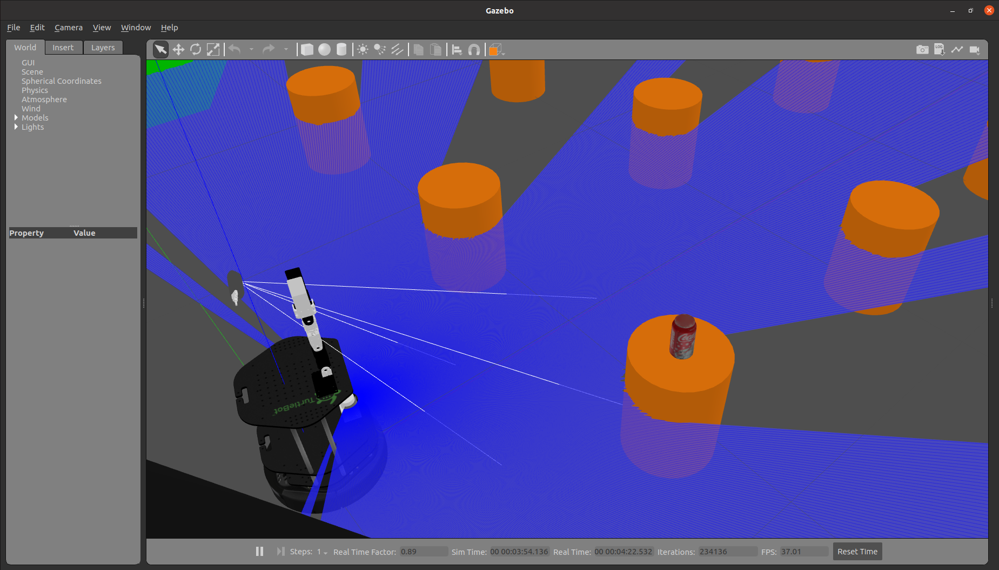
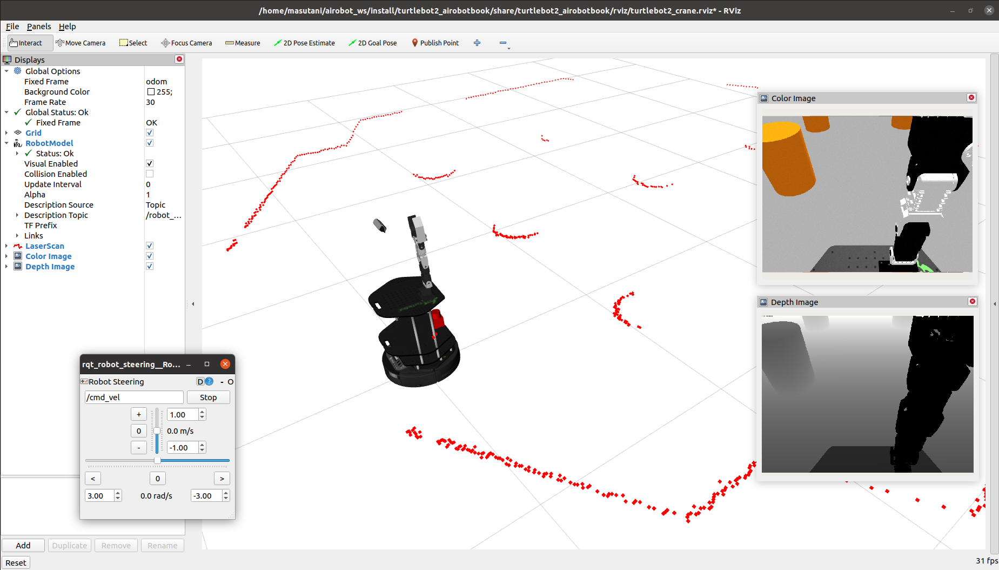

# 「ROS2とPythonで作って学ぶAIロボット入門」のためのTurtlebot2モデル




## 概要

ROS2とPythonで作って学ぶAIロボット入門（出村・萩原・升谷・タン著，講談社）の成果を実証するためのモデルを提供します．

- 構成要素
  - 移動台車 Yujin Robot Kobuki（棚板付き）
  - ロボットアーム アールティ CRANE+ V2
  - 測域センサ 北陽電機 URG-04LX-UG01
  - 深度カメラ Intel RealSense D435

## インストール

```
sudo apt -y install ros-foxy-gazebo-ros ros-foxy-camera-info-manager
sudo apt -y install ros-foxy-realsense2-description
sudo apt -y install ros-foxy-diagnostic-updater ros-foxy-ecl-linear-algebra ros-foxy-kobuki-core ros-foxy-xacro ros-foxy-joint-state-publisher
sudo apt -y install ros-foxy-navigation2 ros-foxy-nav2-bringup
sudo apt -y install ros-foxy-urg-node
sudo apt -y install ros-foxy-tf-transformations
sudo apt -y install ros-foxy-rqt-robot-steering

cd ~/airobot_ws/src
git clone https://github.com/kobuki-base/kobuki_ros_interfaces
git clone -b foxy-devel https://github.com/pal-robotics/realsense_gazebo_plugin
git clone https://github.com/rt-net/crane_plus
git clone https://github.com/AI-Robot-Book/kobuki_ros_airobotbook
git clone https://github.com/AI-Robot-Book/turtlebot2_airobotbook

rosdep install -r -y -i --from-paths .

cd ~/airobot_ws
colcon build
source install/setup.bash
```

### デバイスファイルのルールの設定

```
sudo cp ~/airobot_ws/src/turtlebot2_airobotbook/rules.d/* /etc/udev/rules.d
```
KobukiとCRANE+ V2は同じFTDIのドライバを使っているので，個別のデバイスに合わせたルールの書き換えが必要．うまく設定できれば，以下のようなデバイスファイル（のシンボリックリンク）が作られる．

- Kobuki → `/dev/ttyUSB_kobuki`
- CRANE+ V2 → `/dev/ttyUSB_craneplus`
- URG → `/dev/ttyACM_urg`

## 実行

### Kobukiのモデルの確認
```
ros2 launch kobuki_description robot_description.launch.py rviz:=True
```
### Turtlebot2のシミュレーションの基本
```
ros2 launch turtlebot2_airobotbook turtlebot2_gazebo.launch.py 
```
### Turtlebot2のシミュレーションとRVizの併用
```
ros2 launch turtlebot2_airobotbook turtlebot2_gazebo_rviz.launch.py 
```
### Turtlebot2のシミュレーションで地図作成
```
ros2 launch turtlebot2_airobotbook turtlebot2_gazebo_slam.launch.py 
```
### Turtlebot2のシミュレーションでナビゲーション
```
 ros2 launch turtlebot2_airobotbook turtlebot2_gazebo_nav2.launch.py 
```
### Turtlebot2 + CRANE+ V2 Realsense D435 のシミュレーションの基本
```
ros2 launch turtlebot2_airobotbook turtlebot2_crane_gazebo.launch.py 
```

### Turtlebot2 + CRANE+ V2 Realsense D435 のシミュレーションとRVizの併用
```
ros2 launch turtlebot2_airobotbook turtlebot2_crane_gazebo_rviz.launch.py 
```

## ヘルプ

- 実機を動かすための設定がまだ不十分です．
- シミュレーションはIgnition Gazeboへ移行したいです．

## 著者

升谷 保博

## 履歴

- 2022-08-25: ライセンス・ドキュメントの整備
- 2022-08-23: 公開

## ライセンス

Copyright (c) 2022, MASUTANI Yasuhiro  
All rights reserved.  
This project is licensed under the Apache License 2.0 license found in the LICENSE file in the root directory of this project.

## 参考文献

- [Open Source Robotics Foundation: TurtleBot2](https://www.turtlebot.com/turtlebot2/)
- [turtlebot: The turtlebot stack provides all the basic drivers for running and using a TurtleBot.](https://github.com/turtlebot/turtlebot)
- [Kobuki: ROS2 runtime libraries, nodes and launchers for the Kobuki](https://github.com/kobuki-base/kobuki_ros)
- [RT Corporation: CRANE+ V2 ROS 2 Packages ](https://github.com/rt-net/crane_plus)
- [Intel® RealSense™: ROS Wrapper for Intel® RealSense™ Devices](https://github.com/IntelRealSense/realsense-ros)
- [PAL Robotics S.L.: Intel RealSense Gazebo ROS plugin](https://github.com/pal-robotics/realsense_gazebo_plugin)
- [ROS device drivers: ROS wrapper for the Hokuyo urg_c library](https://github.com/ros-drivers/urg_node)